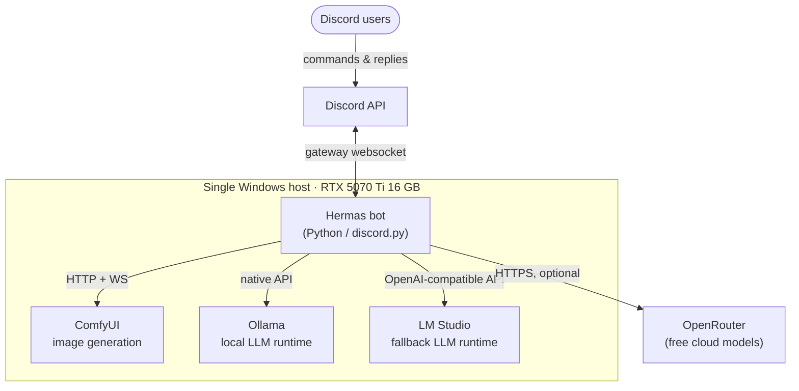
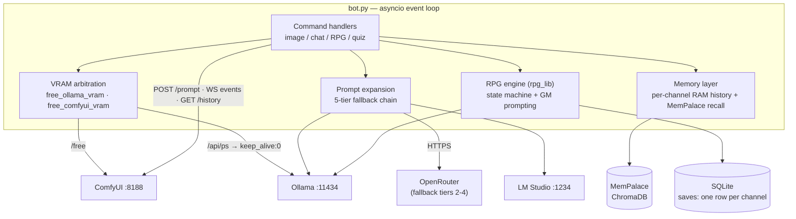
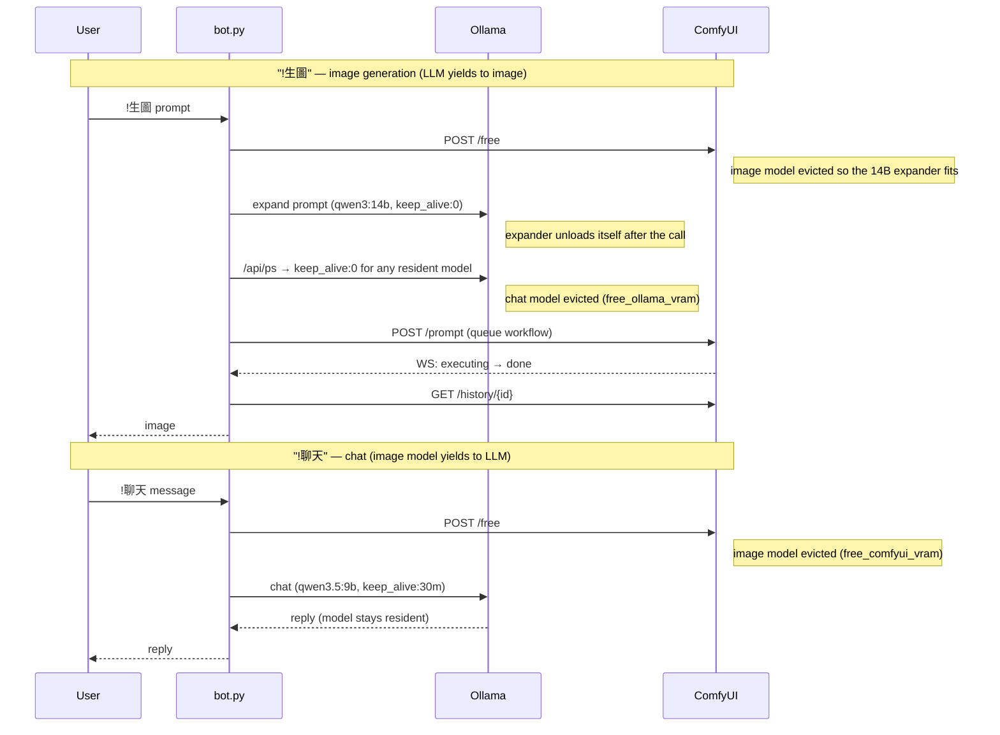

# Architecture

C4-style views of Hermas, from system context down to the components that implement the
VRAM arbitration. Diagrams are Mermaid; GitHub renders them natively.

## Level 1 — System Context

Everything latency-critical runs on one host. OpenRouter is the only cloud dependency and is
used exclusively as a fallback tier — the system has no cloud LLM dependency; every feature
works with local inference only.

## Level 2 — Containers

Blocking I/O (HTTP, WebSocket, LLM calls) is pushed off the event loop with
`asyncio.to_thread`, so an image render (~20 s, up to a minute worst-case with eviction and
cold load) never blocks chat commands from being accepted. Completion of an image job is detected by listening for `executing` /
`execution_error` events on ComfyUI's WebSocket rather than polling.

## Level 3 — The Arbitration Path

The component that makes the whole thing work. Both directions follow the same shape:
*evict the other side, then run.*

Key properties:

- **Eviction is explicit and caller-driven.** `free_comfyui_vram()` posts to ComfyUI's
  `/free` endpoint; `free_ollama_vram()` lists loaded models via `/api/ps` and unloads each
  with a zero `keep_alive`. Every GPU-bound entry point calls the appropriate one first.
- **Residency is policy, not accident.** The chat and RPG models are pinned for 30 minutes
  (consecutive turns pay no reload); the expansion model uses `keep_alive: 0` because an
  image render — which needs the whole card — always follows it (see ADR-0002).
- **Coordination is convention, not mutex.** There is deliberately no lock or queue around
  the GPU; the trade-off and its scale boundary are documented in ADR-0001 and in
  [operations.md](operations.md#known-limitations).

## Data & State

| State | Store | Lifetime | Notes |
|---|---|---|---|
| Chat history | in-process dict, per channel | until restart | capped at 20 messages/channel |
| Long-term memory | MemPalace (ChromaDB) | persistent | recall: similarity ≥ 0.6, top 3, injected into system prompt; new conversations mined in a background thread |
| RPG saves | SQLite, `saves(channel_id PK, state_json, updated_at)` | persistent | full game state serialized per channel; last 3 turns re-injected into the GM prompt each turn |
| Configuration | environment variables (`.env`) | — | every setting has a code default; no secrets in code |
