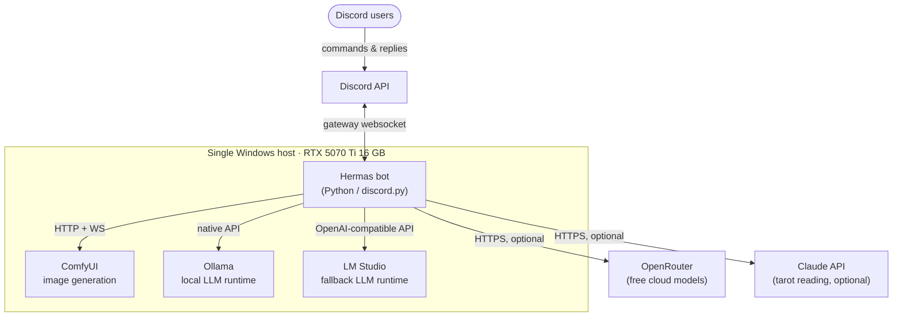
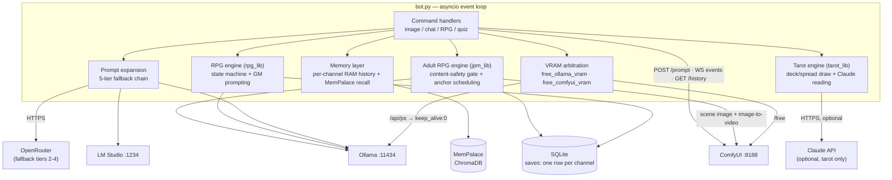
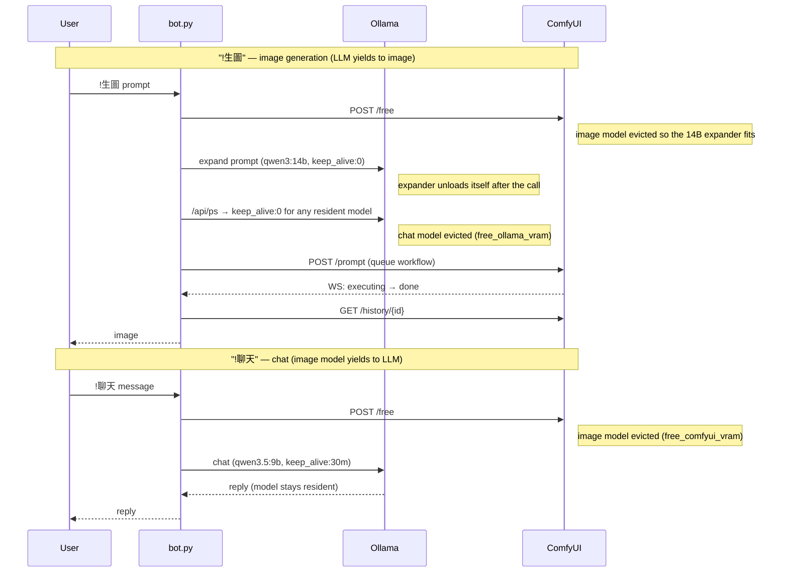

# Architecture

C4-style views of Hermas, from system context down to the components that implement the
VRAM arbitration. Diagrams are Mermaid; GitHub renders them natively.

## Level 1 — System Context

```mermaid
graph TB
    user([Discord users])
    subgraph host["Single Windows host · RTX 5070 Ti 16 GB"]
        hermas["Hermas bot<br/>(Python / discord.py)"]
        comfy["ComfyUI<br/>image generation"]
        ollama["Ollama<br/>local LLM runtime"]
        lms["LM Studio<br/>fallback LLM runtime"]
    end
    discord["Discord API"]
    openrouter["OpenRouter<br/>(free cloud models)"]
    anthropic["Claude API<br/>(tarot reading, optional)"]

    user -->|commands & replies| discord
    discord <-->|gateway websocket| hermas
    hermas -->|HTTP + WS| comfy
    hermas -->|native API| ollama
    hermas -->|OpenAI-compatible API| lms
    hermas -->|HTTPS, optional| openrouter
    hermas -->|HTTPS, optional| anthropic
```

Everything latency-critical runs on one host. OpenRouter and the Claude API are the only cloud
dependencies, and both are optional: OpenRouter is a fallback tier for prompt expansion, and the
Claude API is used for tarot-reading interpretation only when `ANTHROPIC_API_KEY` is configured
— every feature still works with local inference only.

## Level 2 — Containers

```mermaid
graph TB
    subgraph bot["bot.py — asyncio event loop"]
        cmds["Command handlers<br/>image / chat / RPG / quiz"]
        arb["VRAM arbitration<br/>free_ollama_vram · free_comfyui_vram"]
        expand["Prompt expansion<br/>5-tier fallback chain"]
        memory["Memory layer<br/>per-channel RAM history + MemPalace recall"]
        rpg["RPG engine (rpg_lib)<br/>state machine + GM prompting"]
        jpm["Adult RPG engine (jpm_lib)<br/>content-safety gate + anchor scheduling"]
        tarot["Tarot engine (tarot_lib)<br/>deck/spread draw + Claude reading"]
    end
    comfy["ComfyUI :8188"]
    ollama["Ollama :11434"]
    lms["LM Studio :1234"]
    openrouter["OpenRouter<br/>(fallback tiers 2-4)"]
    anthropic["Claude API<br/>(optional, tarot only)"]
    chroma[("MemPalace<br/>ChromaDB")]
    sqlite[("SQLite<br/>saves: one row per channel")]

    cmds --> arb
    cmds --> expand
    cmds --> memory
    cmds --> rpg
    cmds --> jpm
    cmds --> tarot
    arb -->|"/free"| comfy
    arb -->|"/api/ps → keep_alive:0"| ollama
    expand --> ollama
    expand -->|"HTTPS"| openrouter
    expand --> lms
    memory --> chroma
    rpg --> sqlite
    rpg --> ollama
    jpm --> sqlite
    jpm --> ollama
    jpm -->|"scene image + image-to-video"| comfy
    tarot -->|"HTTPS, optional"| anthropic
    cmds -->|"POST /prompt · WS events · GET /history"| comfy
```

The tarot engine draws no VRAM: card selection is local (in-process deck state), and reading
interpretation calls the Claude API directly rather than Ollama or ComfyUI, so it sits outside
the VRAM arbitration path described below entirely. Card artwork is a static asset pipeline
(offline ComfyUI/ControlNet batch restyling of the 78 public-domain Rider–Waite–Smith cards into
an Alphonse Mucha style, Pillow post-processing to overlay correct numeral/name plates, variant
selection recorded in `data/mucha_picks.json`), not a runtime dependency — at request time
`tarot_lib.card_image_path()` prefers the restyled artwork and falls back to the original
Rider–Waite–Smith image if it is missing; reversed cards are rendered with a `Pillow.rotate(180)`
in memory (via `BytesIO`), never written back to disk.

The adult RPG engine (`jpm_lib`) is a second, independently-gated instance of the same
LLM-as-GM pattern as `rpg_lib`, restricted to Discord channels where `channel.is_nsfw()` is
true — every command and button re-checks this before acting. The architecturally interesting
part is where authority sits: the LLM only ever *proposes* a narrative and a JSON delta;
the program owns every number, threshold, and ending. Concretely: an age-18+ character
whitelist is enforced in code (not by prompt instruction) before any character can appear in
an intimate scene; intimacy itself is gated by in-state affection/desire thresholds the model
cannot set directly; image prompts are assembled by the program from a fixed per-character
appearance string plus the model's scene description, which must pass a minor-reference filter
first (the assembled prompt is checked again before image-to-video); and when either of two
specific characters appears in a turn, that turn's image is forced into a clothed prompt state.
Long-running plot beats ("story anchors") are scheduled the same way — the program checks
trigger conditions and can defer a ready anchor for up to a fixed number of turns so it never
overrides the scene the player is currently steering, with a hard cap so no anchor defers
forever. Turn-over-turn context is kept small by structured memory (a short plot summary plus
one line per character, which let full-text history shrink from six turns to two)
and by a chapter-title de-duplication pass that re-asks the model for a new title when it
repeats a recent one. Media reuses the existing pipelines rather than adding new ones: scene
stills go through the same ComfyUI `build_workflow()` as `!生圖`, and optional 5/10 s
image-to-video clips reuse `video_lib`'s Wan2.2 TI2V 5B path. All GPU work takes the bot's
existing lock — LLM calls through the same `local_generation_context` injection point `rpg_lib`
uses, image and video through the existing `gpu_task`-wrapped runners — so this engine adds no
new arbitration primitive — only additional named guard groups
(`single_operation("jpm")` per turn, `"jpm_media"` for image/video) to the existing per-channel
reentrancy pattern.

Blocking I/O (HTTP, WebSocket, LLM calls) is pushed off the event loop with
`asyncio.to_thread`, so an image render (~20 s, up to a minute worst-case with eviction and
cold load) never blocks chat commands from being accepted. Completion of an image job is detected by listening for `executing` /
`execution_error` events on ComfyUI's WebSocket rather than polling.

## Level 3 — The Arbitration Path

The component that makes the whole thing work. Both directions follow the same shape:
*evict the other side, then run.*

```mermaid
sequenceDiagram
    participant U as User
    participant B as bot.py
    participant O as Ollama
    participant C as ComfyUI

    Note over U,C: "!生圖" — image generation (LLM yields to image)
    U->>B: !生圖 prompt
    B->>C: POST /free
    Note right of C: image model evicted so the 14B expander fits
    B->>O: expand prompt (qwen3:14b, keep_alive:0)
    Note right of O: expander unloads itself after the call
    B->>O: /api/ps → keep_alive:0 for any resident model
    Note right of O: chat model evicted (free_ollama_vram)
    B->>C: POST /prompt (queue workflow)
    C-->>B: WS: executing → done
    B->>C: GET /history/{id}
    B-->>U: image

    Note over U,C: "!聊天" — chat (image model yields to LLM)
    U->>B: !聊天 message
    B->>C: POST /free
    Note right of C: image model evicted (free_comfyui_vram)
    B->>O: chat (qwen3.5:9b, keep_alive:30m)
    O-->>B: reply (model stays resident)
    B-->>U: reply
```

Key properties:

- **Eviction is explicit and caller-driven.** `free_comfyui_vram()` posts to ComfyUI's
  `/free` endpoint; `free_ollama_vram()` lists loaded models via `/api/ps` and unloads each
  with a zero `keep_alive`. Every GPU-bound entry point calls the appropriate one first.
- **Residency is policy, not accident.** The chat and RPG models are pinned for 30 minutes
  (consecutive turns pay no reload); the expansion model uses `keep_alive: 0` because an
  image render — which needs the whole card — always follows it (see ADR-0002).
- **Coordination is convention, not mutex.** There is deliberately no lock or queue around
  the GPU; the trade-off and its scale boundary are documented in ADR-0001 and in
  [operations.md](operations.md#known-limitations).

## Data & State

| State | Store | Lifetime | Notes |
|---|---|---|---|
| Chat history | in-process dict, per channel | until restart | capped at 20 messages/channel |
| Long-term memory | MemPalace (ChromaDB) | persistent | recall: similarity ≥ 0.6, top 3, injected into system prompt; new conversations mined in a background thread |
| RPG saves | SQLite, `saves(channel_id PK, state_json, updated_at)` | persistent | full game state serialized per channel; last 3 turns re-injected into the GM prompt each turn |
| Adult RPG saves | SQLite, `channel_saves(channel_id PK, state_json, updated_at)` — its own database file, separate from the wuxia RPG saves | persistent | one save per channel, cleared on ending; structured plot/character-note memory kept alongside recent turns to bound prompt size |
| Configuration | environment variables (`.env`) | — | every setting has a code default; no secrets in code |
